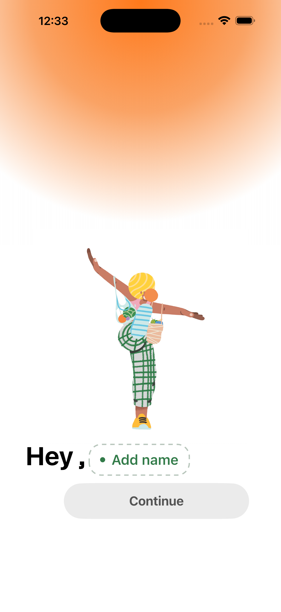
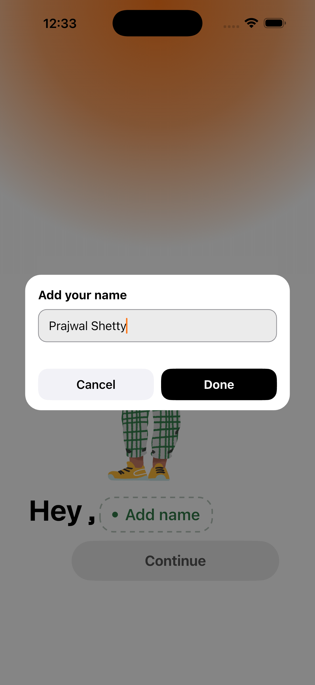
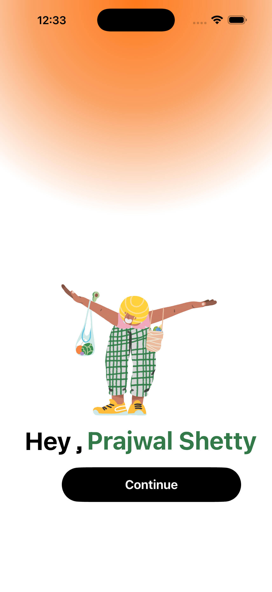
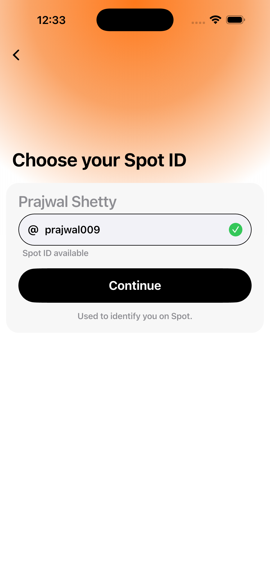

## 📱 App User Interface & Walkthrough

 

### 1. Onboarding & Account Setup
This flow handles user registration, identity verification, profile setup, and handle creation.

<table border="0" cellpadding="10" cellspacing="0" width="100%">
  <tr valign="top">
    <td width="20%" align="center">
        
      <b>1. Onboarding</b>
    </td>
    <td width="20%" align="center">
        
      <b>2. Auth Options</b>
    </td>
    <td width="20%" align="center">
        
      <b>3. Create Account</b>
    </td>
    <td width="20%" align="center">
        
      <b>4. Email Verification</b>
    </td>
  </tr>
  <tr valign="top">
    <td width="20%" align="center">
        
      <b>5. Add Name</b>
    </td>
    <td width="20%" align="center">
        
      <b>6. Input Name</b>
    </td>
    <td width="20%" align="center">
        
      <b>7. Name Confirmed</b>
    </td>
    <td width="20%" align="center">
        
      <b>8. Choose Handle</b>
    </td>
  </tr>
</table>

* **Onboarding & Auth:** Users are introduced to the core platform features and presented with authentication choices (Sign Up / Sign In).
* **Identity & Handle Setup:** Collects user credentials, verifies email address via OTP, sets the display name, and registers a unique user handle (`@username`).

---

 

### 2. User Personalization Flow
Configures user preferences to tailor search recommendations and product discovery.

<table border="0" cellpadding="10" cellspacing="0" width="100%">
  <tr valign="top">
    <td width="25%" align="center">
        
      <b>1. Personalization</b>
    </td>
    <td width="25%" align="center">
        
      <b>2. Date of Birth</b>
    </td>
    <td width="25%" align="center">
        
      <b>3. Gender Selection</b>
    </td>
    <td width="25%" align="center">
        
      <b>4. Preferences</b>
    </td>
  </tr>
</table>

* **Profile Details:** Collects birth date using an iOS-native wheel picker and selects gender identity.
* **Shopping Preferences:** Allows users to pick interest tags (e.g., Casual Wear, Sneakers) to refine AI product search algorithms.

---

 

### 3. AI Search & Product Discovery Flow
The primary search interface where natural language processing finds local products and stores.

<table border="0" cellpadding="10" cellspacing="0" width="100%">
  <tr valign="top">
    <td width="25%" align="center">
        
      <b>1. Home Screen</b>
    </td>
    <td width="25%" align="center">
        
      <b>2. Search Input</b>
    </td>
    <td width="25%" align="center">
        
      <b>3. AI Processing</b>
    </td>
    <td width="25%" align="center">
        
      <b>4. Search Results</b>
    </td>
  </tr>
</table>

* **Prompt-Based Search:** Users type or speak natural queries into the AI search bar.
* **Spotting State & Results:** Displays live AI loading feedback ("Spotting...") before rendering matched stores and available items in a conversational UI card format.

---

 

### 4. Product Reservation & Checkout Flow
Enables users to reserve physical inventory at nearby partner stores for pickup.

<table border="0" cellpadding="10" cellspacing="0" width="100%">
  <tr valign="top">
    <td width="25%" align="center">
        
      <b>1. Product Detail</b>
    </td>
    <td width="25%" align="center">
        
      <b>2. Checkout Details</b>
    </td>
    <td width="25%" align="center">
        
      <b>3. Confirmation Modal</b>
    </td>
    <td width="25%" align="center">
        
      <b>4. Notification Alert</b>
    </td>
  </tr>
</table>

* **Item Details:** Bottom sheet modal displaying item details, stock count, store distance, and item quantity selection.
* **Reservation Checkout:** Reviews order summary, pickup time window, and terms agreement prior to issuing a live pickup reservation.

---

 

### 5. Map Exploration, Navigation & Store Profiles
Map integration for finding physical local stores, navigating, and viewing merchant profiles.

<table border="0" cellpadding="10" cellspacing="0" width="100%">
  <tr valign="top">
    <td width="25%" align="center">
        
      <b>1. Map Explore</b>
    </td>
    <td width="25%" align="center">
        
      <b>2. Store Navigation</b>
    </td>
    <td width="25%" align="center">
        
      <b>3. Shop Profile</b>
    </td>
    <td width="25%" align="center">
        
      <b>4. Active Cart</b>
    </td>
  </tr>
</table>

* **Location Services:** Displays nearby partner stores on an interactive map with turn-by-turn routing to the store location.
* **Store & Cart Management:** Shows merchant operating hours, inventory overview, ratings, and items stored in the cart.

---

 

### 6. Profile & Account Settings

<table border="0" cellpadding="10" cellspacing="0" width="100%">
  <tr valign="top">
    <td width="25%" align="center">
        
      <b>1. Profile Preview</b>
    </td>
    <td width="25%" align="center">
        
      <b>2. Profile Overview</b>
    </td>
    <td width="50%">
       
      <b>Overview</b>
      
Manages user profile preferences, account details, saved locations, reservation history, and overall app settings.

    </td>
  </tr>
</table>
